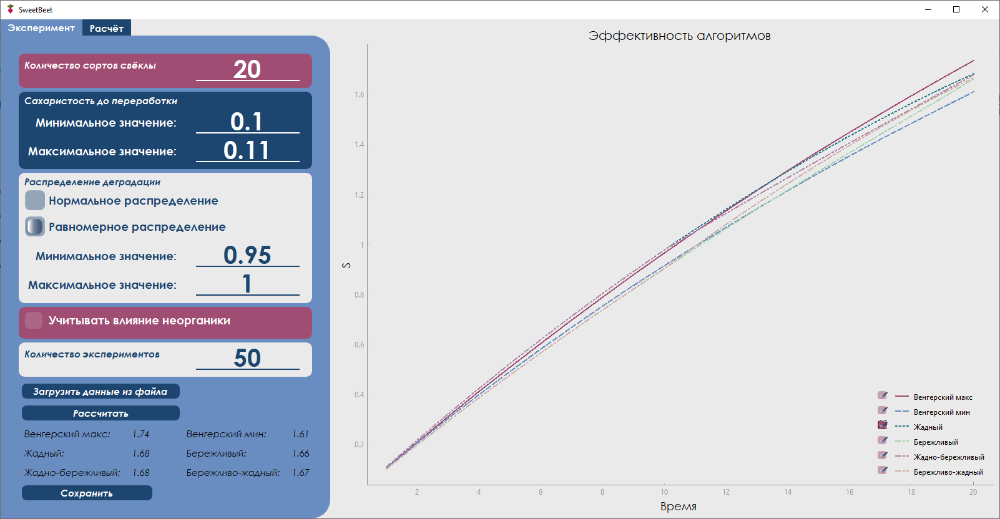
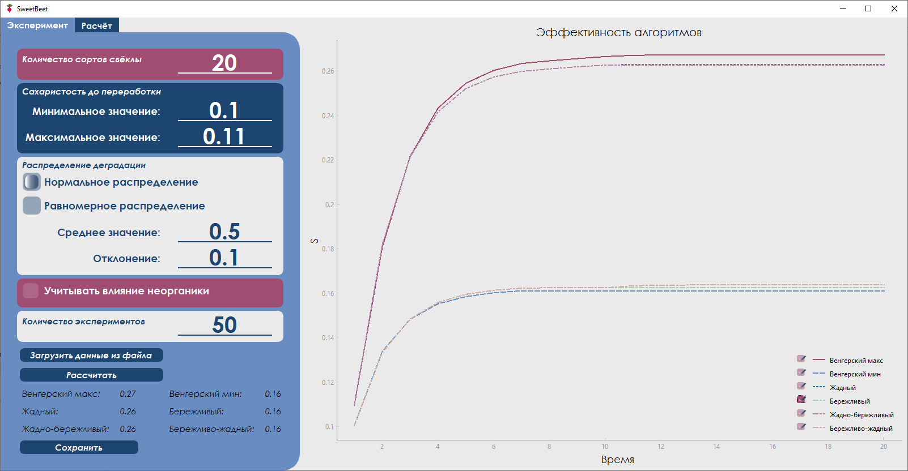
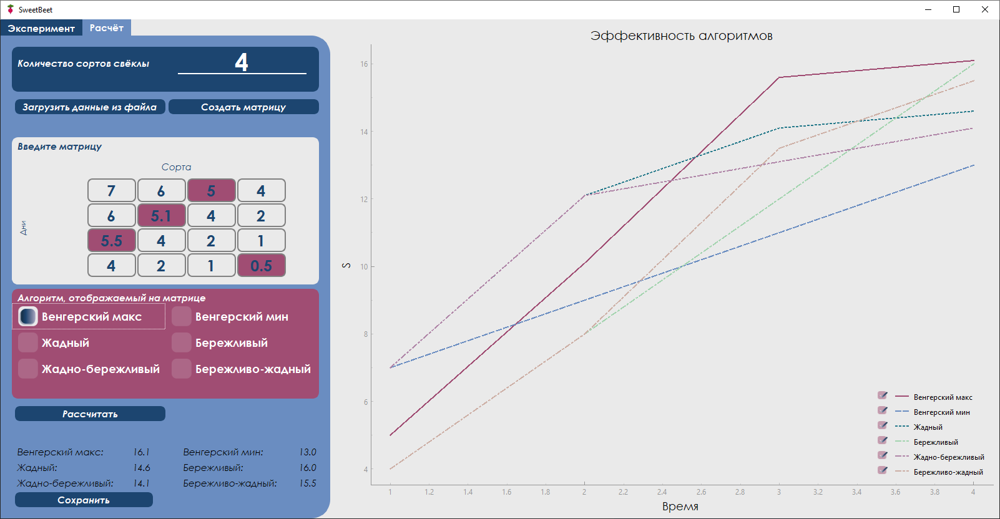
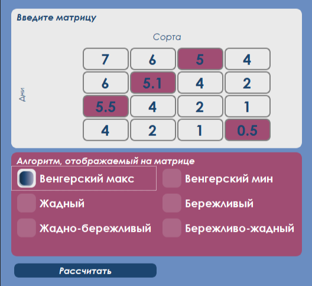
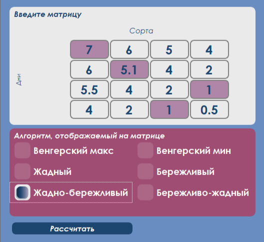
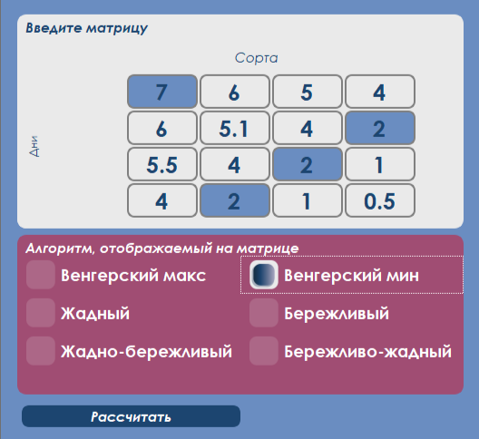
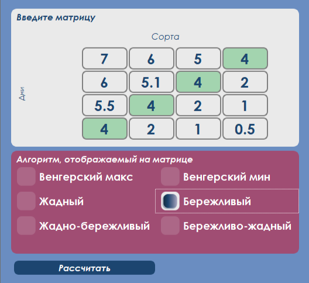
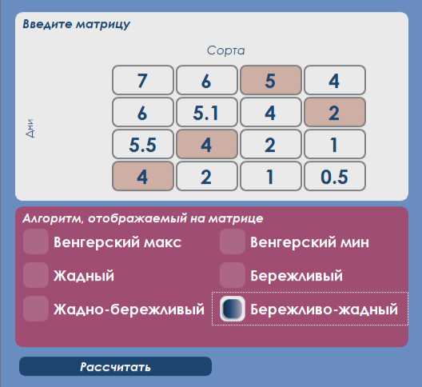
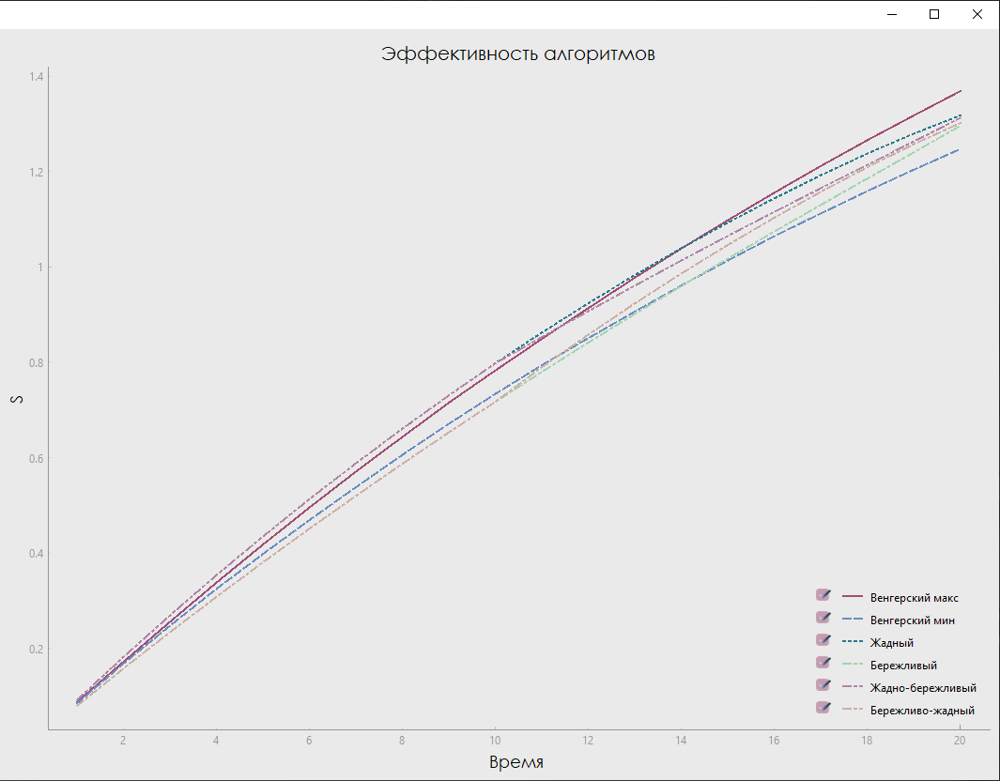
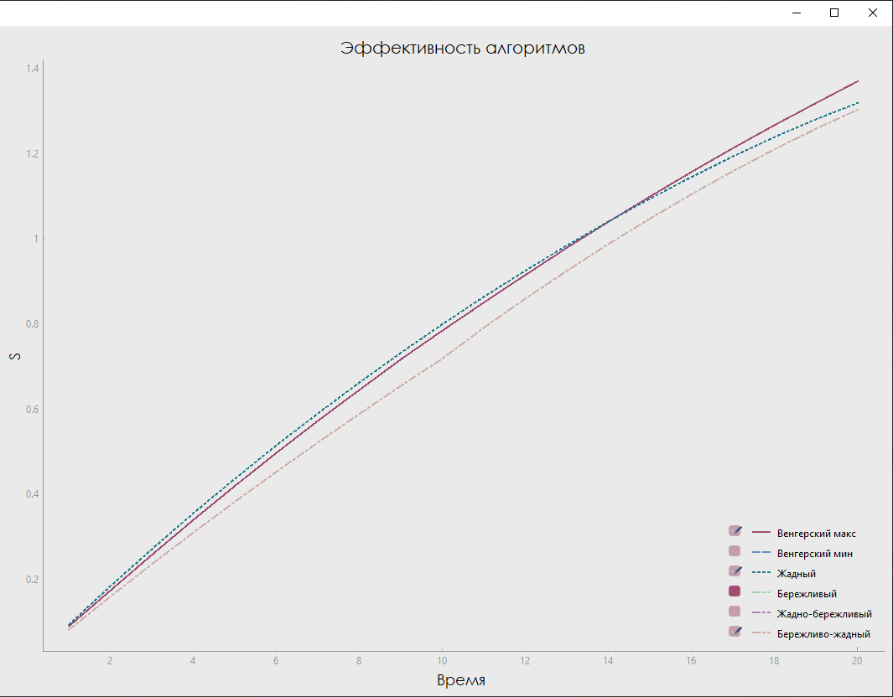

## SweetBeet

Приложение для сравнения алгоритмов решения задачи о назначениях на примере переработки нескольких сортов сахарной свёклы

Работу выполнили: [aartyomm](https://github.com/aartyomm), [un1i](https://github.com/un1i), [JKurdina](https://github.com/JKurdina)

### Основные возможности программы

- **Проведение заданного количества экспериментов с введёнными параметрами и построение графика на основе средних значений**

  

  

- **Проведение расчёта данных из введённой матрицы и вывод ответов**

  

### Вспомогательные инструменты

- **При проведении расчёта ответы могут быть выведены для разных алгоритмов**

  ||||
  |-|-|-|

  ||||
  |-|-|-|

- **Есть возможность скрыть выбранные графики**

  
  

- **Реализована возможность ввода данных из файла**

  *Данные вводятся из .txt файла. Для того, чтобы данные ввелись корректно, необходимо правильное форматирование*

  - "Эксперимент"

	В каждой строке вводятся, соответственно:
	- количество сортов свёклы
	- диапазон сахаристости до переработки
	- распределение
	- параметры выбранного распределения
	- учёт влияния неорганики - "да" или "нет"
	- количество экспериметов

	

  - "Расчёт"

	В первой строке вводится количество столбцов (сортов свёклы), затем вводится матрица
	Количество пробелов не иммеет значения
	
	|||
	|-|-|
	
- **А также вывода в файл**
